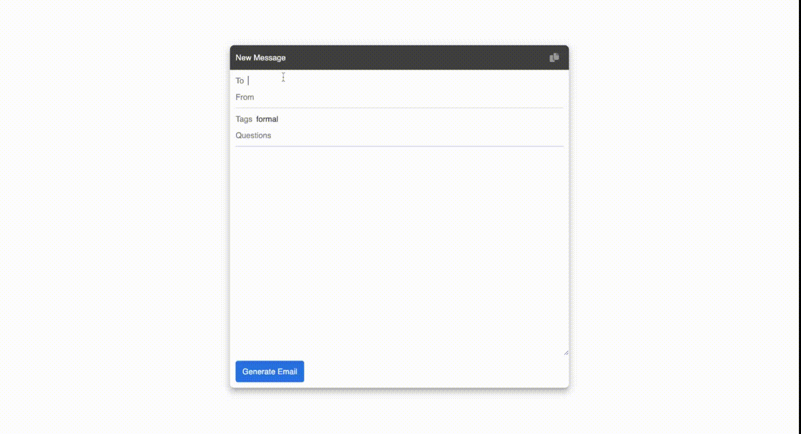

# Email Generator



This is a simple program that will generate an email for you. You can input a list of questions and tags and the program will use [GPT-3](https://openai.com/api/) generate an email with the relevant information.

## Setup

1. If you don’t have Node.js installed, [install it from here](https://nodejs.org/en/)

2. Clone this repository

3. Navigate into the project directory

   ```bash
   $ cd email-generator
   ```

4. Install the requirements

   ```bash
   $ npm install
   ```

5. Make a copy of the example environment variables file

   ```bash
   $ cp .env.example .env
   ```

6. Add your [API key](https://beta.openai.com/account/api-keys) to the newly created `.env` file

7. Run the app

   ```bash
   $ npm run dev
   ```

You should now be able to access the app at [http://localhost:3000](http://localhost:3000)!
